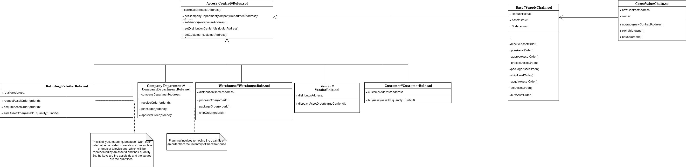

# Telco-Chain Ethereum Dapp: A smart contract enabling tracking of an ordering process.

  This repository contains an Ethereum DApp that demonstrates a Supply Chain flow between a Retailer and a Customer of telco assets.

  The user story is similar to any commonly used supply chain process. A Retailer can add submit orders of assets; then, the company reviews the orders and approve them; following this, the distribution center receives  the order and process it; once the order is ready, it is shipped to retailer for selling the asset composing the order. The whole cycle of ordering is stored in the blockchain. A Customer can buy telco assets, such as mobile phones and tablets from the Retailers. Additionally a Retailer can mark an item as ForSale, and similarly a Customer can mark an item as Sold when the amount, which is paid for it, is sufficient and ownership is transferred to the Customer.

  The **truffle.js** file of this project is configured to deploy the smart contract in the Ethereum testnet, Rinkeby. The Infura and Metamask are utilized in order to deploy and use the smart contract. Create a .env file and define the INFURA_KEY, INFURA_ENDPOINT and INFURA_MNEMONIC. In the **truffle.js** file use the INFURA_KEY, INFURA_ENDPOINT and INFURA_MNEMONIC. The contract's address is *0x6CaeE2848724ace93006013577598d8C7aD1CBa3*, with transaction hash, *0xf89babdb5ddc64b29e356a44de80b77a0d816039fae672cae8dd0571cc8acc68*.

  

  The scenario implemented by this project can easily perceived by the following diagrams.
**Sequence Diagram:**
  
**State Diagram:**
  
**Class Diagram:**
  

 The DApp User Interface:


## Getting Started

### Prerequisites

Please make sure you've already installed ganache-cli, Truffle and enabled MetaMask extension in your browser.

<!-- ```
Give examples (to be clarified)
``` -->

### Installing

<!-- A step by step series of examples that tell you have to get a development env running

Clone this repository:

```
git clone https://github.com/udacity/nd1309/tree/master/course-5/project-6
```

Change directory to ```project-6``` folder and install all requisite npm packages (as listed in ```package.json```):

```
cd project-6
npm install
``` -->

Launch Ganache:

```
ganache-cli -m "spirit supply whale amount human item harsh scare congress discover talent hamster"
```

Your terminal should look something like this:


In a separate terminal window, Compile smart contracts:

```
truffle compile
```

Your terminal should look something like this:


This will create the smart contract artifacts in folder ```build\contracts```.

Migrate smart contracts to the locally running blockchain, ganache-cli:

```
truffle migrate
```

Your terminal should look something like this:


Test smart contracts:

```
truffle test
```

All 15 tests should pass.


In a separate terminal window, launch the DApp:

```
npm run dev
```

## Built With

* [Ethereum](https://www.ethereum.org/) - Ethereum is a decentralized platform that runs smart contracts
* [IPFS](https://ipfs.io/) - IPFS is the Distributed Web | A peer-to-peer hypermedia protocol
to make the web faster, safer, and more open.
* [Truffle Framework](http://truffleframework.com/) - Truffle is the most popular development framework for Ethereum with a mission to make your life a whole lot easier.

* Solidity v0.5.0 (solc-js)
* Ganache-cli v6.2.5 (ganache-core: 2.3.3)
* Truffle v5.0.4 (core: 5.0.4)
* Node v11.6.0
* Web3.js v1.0.0-beta.55

## Acknowledgments
* Solidity
* Truffle
* Infura
